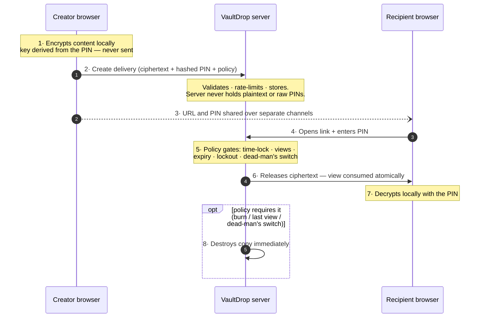
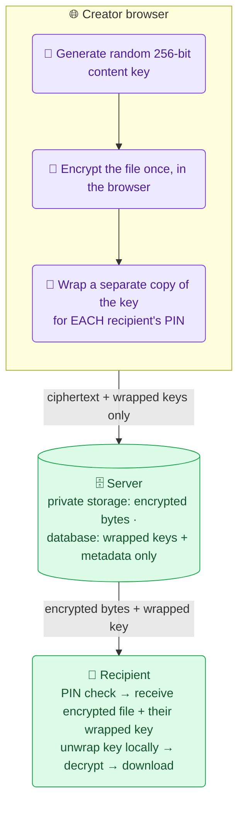
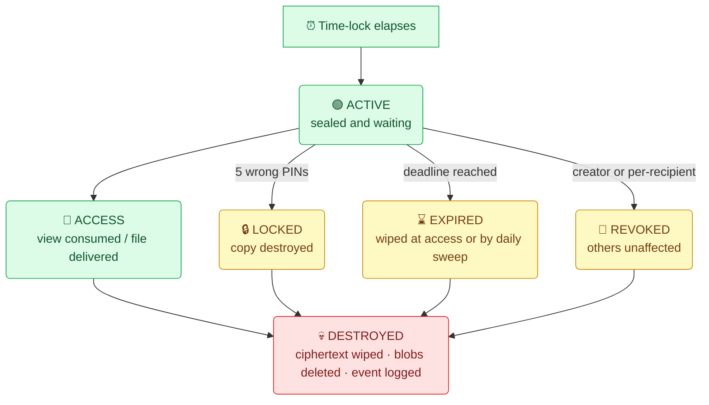
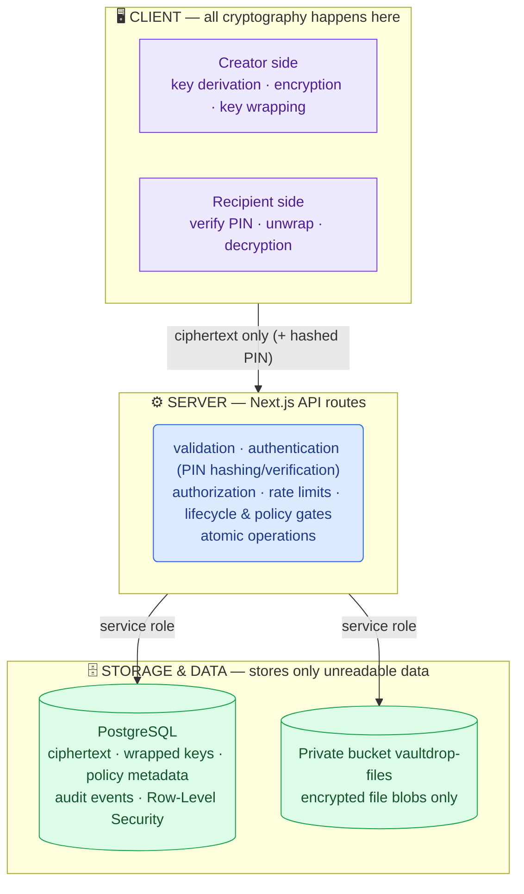

# VaultDrop

**Policy-driven secure delivery for sensitive text and files — encrypted in the browser, governed by explicit access policy, and destructible by design.**

Security documentation: [`docs/threat-model.md`](docs/threat-model.md) · [`docs/technical-overview.md`](docs/technical-overview.md)

## The Core Idea

> ### 🎯 WHO → HOW → WHEN → HOW MANY TIMES → WHEN DESTROYED
>
> **VaultDrop models shared content as a policy-driven DELIVERY — not a static encrypted blob.**
>
> Every delivery answers five questions — and the *server* enforces the answers on every request.

Most sharing tools treat content as a static blob behind a URL. In VaultDrop, shared content — a text secret **or** an encrypted file — becomes a **delivery**: a governed object whose availability follows an explicit policy the creator defines up front.

| Dimension | Question | Mechanism |
|---|---|---|
| **WHO** | Who may open it? | Recipient-specific links — each recipient gets their own URL, PIN, and independently encrypted copy |
| **HOW** | How is identity proven? | Out-of-band verification — URL and 6-digit PIN travel through **separate channels**, so intercepting one reveals nothing |
| **WHEN** | When can it be opened? | Server-enforced time-lock (sealed until the chosen moment) plus configurable expiry |
| **HOW MANY TIMES** | How many opens are allowed? | Atomic view counting, including one-time burn-after-read |
| **WHEN DESTROYED** | What ends it? | Creator revocation, per-recipient revocation, PIN-lockout destruction, dead-man's switch, or automatic expiry |

A delivery is therefore not just ciphertext sitting at an address: its state changes only through authorization, time, access count, and lifecycle conditions — decided server-side on every request.

## Why This Is Different

Conventional secure-sharing tools are **content-centric**: the unit of work is "one blob plus one link." VaultDrop is **delivery-centric**: one dispatch fans out to multiple recipients, and every copy carries its own credentials, state, and lifecycle.

VaultDrop is an independent implementation inspired by the secure-information-sharing problem represented by [PrivateBin](https://privatebin.info/) — which establishes the baseline well (client-side encryption, zero server-side plaintext). VaultDrop preserves that essential purpose and builds a complete delivery model around it:

| Capability | Reference baseline (PrivateBin-style) | VaultDrop |
|---|---|---|
| Share mechanism | Link alone | URL **plus a separate 6-digit PIN** per open |
| Unit of control | One blob for everyone | **One delivery → N recipients**, each an independently encrypted copy |
| Identity | Possession of link = access | **Per-open PIN authentication**, bcrypt-verified server-side |
| Scheduled access | No | **Server-enforced time-lock release** |
| View limiting | No | **Atomic maximum-view enforcement** — exact even under concurrency |
| Revocation | Manual delete-everything | Whole-delivery recall **or surgical per-recipient destruction** |
| Sender liveness | N/A | **Dead-man's switch** — silence ⇒ self-destruction |
| Files | Rare / unencrypted-at-rest options | **First-class encrypted file delivery** |
| Lifecycle end | Manual deletion | **Unified lifecycle** — every exit path deterministically destroys ciphertext and stored blobs |

These controls are not toggles bolted onto a pastebin. They compose into one state machine where every transition — release, open, lockout, revoke, expire, self-destruct — is a server-side decision recorded as an audit event, and every terminal transition destroys the ciphertext and any stored file blob.

## Core Features

### Secure Sharing
- **Encrypted text secrets** — AES-256-GCM, derived and applied entirely in the browser
- **Encrypted File Delivery** — envelope encryption; one upload serves many recipients, each with their own wrapped key
- **Client-side encryption** — raw PINs, plaintext, and decryption keys never reach the server
- **Private Encrypted Storage** — file ciphertext lives in a private bucket under randomized paths

### Access Control
- **Recipient-Specific Access** — up to 50 individually addressable copies per delivery
- **Separate links and PINs** — two-channel distribution defeats link forwarding
- **PIN authentication** — checked only as unrecoverable hashes; typed digits never reach the server
- **PIN lockout** — 5 failed attempts destroy that copy server-side
- **Rate limiting** — database-backed sliding-window throttle on PIN attempts
- **Creator revocation** — recall an entire delivery
- **Recipient revocation** — destroy a single copy; others unaffected

### Lifecycle Control
- **Maximum Views** — counts stay exact even when many people open at once
- **Burn After Reading** — one-time opens that erase themselves while serving
- **Expiration** — deliveries die at their deadline even if nobody visits
- **Time-Locked Release** — sealed until the chosen moment, enforced before authentication matters
- **Dead-Man's Switch** — the creator must periodically renew, or the delivery self-destructs
- **Destruction** — every exit path converges on deterministic server-side deletion

### Reliability & Security
- **Atomic Consumption** — database-level locking means simultaneous opens have exactly one winner
- **Race-condition protection** — failed-PIN counting cannot lose track, no matter how many attempts land at once
- **Row-Level Security** — even someone holding database keys cannot read or modify delivery data
- **Audit events** — every attempt (successful or not) recorded with type, timestamp, and hashed IP
- **Lifecycle cleanup** — daily purge sweep plus at-access enforcement

## How VaultDrop Works



1. **Encrypt locally** — the creator's browser derives keys from the PIN and encrypts before anything touches the network.
2. **Configure delivery policy** — who, when, how many times, what happens afterward.
3. **Create delivery** — the API validates, rate-limits, and persists ciphertext, PIN hashes, and policy. It returns per-recipient URLs and PINs for out-of-band distribution.
4. **Authenticate** — the recipient proves knowledge of the PIN; the URL alone grants nothing.
5. **Policy check** — the server evaluates time-lock, expiry, revocation, lockout, dead-man's-switch, and remaining views *before* releasing anything.
6. **Atomic consumption** — the view is decremented inside a locked transaction; burn-after-read destroys the copy in the same transaction that serves it.
7. **Decrypt locally** — the recipient's browser re-derives the key and decrypts; tampered content simply refuses to decrypt.
8. **Lifecycle continues** — expiry, revocation, lockout, or dead-man's-switch silence converge on destruction.

## Testing & Reliability

> ### ✅ 126 / 126 AUTOMATED SCENARIOS PASS
>
> Seven suites, executed against a live Supabase backend.

| Suite | Result | Covers |
|---|:---:|---|
| Legacy | ✅ **4/4** | Single-recipient backward compatibility |
| **Multi-recipient** | ✅ **24/24** | Independent copies, per-recipient revocation, isolation |
| Time-lock | ✅ **9/9** | `423` before release, post-release behavior, validation rules |
| Lockout | ✅ **5/5** | Countdown, destruction after 5 failures |
| Dead man's switch | ✅ **10/10** | Renewal, deadline expiry, self-destruction |
| **Hardening** | ✅ **31/31** | Concurrency races (exactly-one-winner), parallel wrong-PIN counting, revoked/expired denial, plaintext-leak scans of every API response |
| **File delivery** | ✅ **43/43** | Byte-exact round-trips (PDF/PNG/random), wrong-PIN unwrap rejection, size/MIME enforcement, lifecycle blob deletion, 6-way open race, private-bucket denial probes |

Also verified:

- TypeScript type-check: **PASS** · ESLint: **0 errors** · Production deployment: **LIVE** (Vercel)
- Real-browser end-to-end test: create → replace/remove file interactions → deliver → decrypt → byte-exact download comparison → burn-after-read second visit

### Performance (measured, not estimated)

> **Measured against a live backend — observed results, not estimates.**

Each timing includes all the security work (encryption, PIN checking, database updates):

| Action | Measured time |
|---|---|
| Encrypting a secret in the browser | ~0.2 s |
| Creating a delivery (click Send → link ready) | ~1.8–2 s |
| Opening a delivery (correct PIN → secret shown) | ~1.2 s |
| Rejecting a wrong PIN | ~1.3 s |
| Uploading a 1 MB encrypted file | 3–5 s |
| Downloading a 1 MB encrypted file | 4–5 s |
| Uploading / downloading a 5 MB encrypted file | ~4 s each |

Under pressure (also measured):

- **30 simultaneous link opens** → all 30 served in under 2 seconds.
- **10 simultaneous correct PIN attempts on a one-view delivery** → exactly **1 winner**; the other 9 refused. Nothing leaked, nothing double-opened.

These actions are not instant on purpose: every request runs real security work (PIN hashing, policy enforcement, locked database transactions) — safe by design, still comfortably responsive.

### Accessibility (verified, not claimed)

> ✅ **43 / 43 accessibility checks passed** — real-browser audit across both pages.

- **Keyboard operation** — the whole product works without a mouse: composing, sending, file picking, PIN entry, unlocking
- **Screen-reader labels** — every control labeled; wrong-PIN errors announced aloud, including remaining attempts
- **Visible focus** — always clear which control is active while tabbing
- **WCAG contrast** — passes official thresholds in both light and dark themes
- **Mobile usability** — no sideways scrolling on phones; comfortably sized tap targets

Scope note: targeted spot-checking of the main flows, not a certified full screen-reader audit. Two issues found during the audit were fixed immediately — attribute-only changes, no design impact.

## Innovation: Policy-Driven Delivery

The primary innovation is **not** inventing cryptography. VaultDrop uses standard, well-analyzed primitives — AES-256-GCM, PBKDF2-SHA256, bcrypt — exactly as intended. The innovation is the application-level model that combines:

> **recipient identity + authentication + time constraints + view constraints + revocation + conditional destruction**

…into a single, coherent delivery lifecycle enforced by the server rather than promised by the UI.

A concrete delivery:

```
Delivery:   "Production API credential"

Policy:
  WHO          → Alice (her own link + her own PIN)
  HOW          → 6-digit PIN, sent over a different channel than the link
  WHEN         → unlocks today at 8 PM
  HOW MANY     → maximum 2 views
  EXPIRY       → dies in 24 hours regardless
  AFTERWARD    → destroyed after final allowed view
```

Before 8 PM, even Alice with the correct PIN gets `423 Locked`. After two authorized opens, the copy is gone — a third attempt returns `410 Gone`, not a polite warning. If the creator recalls it at 9 PM, destruction is immediate and total. The identical model governs encrypted files: same policy surface, same gates, same destruction semantics — the only difference is envelope encryption around a larger payload.

This is the difference between "an encrypted pastebin with extra buttons" and a platform where sharing is a controlled, auditable process.

## Encrypted File Delivery

Files use envelope encryption so a single upload can serve multiple recipients without re-uploading or ever exposing the content key:



Verified implementation properties:

- **256-bit random content key** per file; wrapped separately for each recipient — the raw key never reaches the server
- **Tamper-proof encryption** — any modification makes decryption fail instead of serving altered content
- Ciphertext stored in the **private `vaultdrop-files` bucket** as nameless binary data — no public download policies exist
- **Randomized object paths** (`deliveries/<deliveryId>/<random>.bin`) — original filenames never appear in storage
- The **plaintext file is never stored** — uploads and downloads carry encrypted bytes only; original name/type live solely as metadata returned to the authenticated recipient

## Security Architecture

In plain terms: content is scrambled inside your browser using a key made from the recipient's PIN; the server stores only unreadable data plus PIN hashes, and destroys both on schedule.

> **Security Boundary:** plaintext content and decryption material remain on the client under the documented threat model.

**Cryptographic layer**

| Primitive | Role | Parameters |
|---|---|---|
| **AES-256-GCM** | Text + file encryption, key wrapping | 128-bit auth tags |
| **PBKDF2-SHA256** | PIN → key derivation (text and file unwrap) | **600,000 iterations**, **128-bit salt** per copy |
| Nonces | Fresh per encryption | **96-bit** |
| **bcrypt** | PIN hash at rest | Applied to `SHA-256(pin)` transport value |
| SHA-256 | PIN transport hashing | Raw PIN never leaves the browser on modern flows |

**Enforcement layer**

- **Row-Level Security** on all tables — anon keys cannot read or modify delivery data
- **Server-side authorization** — creator tokens (distinct from delivery IDs) gate management endpoints; recipient tokens gate exactly one copy
- **Database-backed PIN rate limiting** — sliding-window throttling that survives restarts and works across instances
- **Atomic Consumption** — a PostgreSQL function holds a transaction-level advisory lock plus `FOR UPDATE` row locks during consumption; failed-attempt counting uses single-statement atomic updates
- **Private Storage** — no public bucket policies; access only through server routes holding service-role credentials
- **Service-role isolation** — privileged keys exist exclusively inside server-side API routes, never shipped to browsers

## Why Atomic Consumption Matters

Set **maximum views = 1** and suppose two requests arrive at the same moment:

| ❌ Without atomic enforcement | ✅ With VaultDrop |
|---|---|
| Request A checks: "1 view left" — allowed | Request A acquires the database lock |
| Request B checks: "1 view left" — also allowed | Request A consumes the view → 0 left, secret served |
| **Both read the "one-time" secret** | Request B waits on the lock, then sees 0 left → **rejected** |

> **Concurrency Guarantee:** a one-view delivery has exactly one successful concurrent consumer.

The count, the burn, and the serving happen inside one locked database transaction — enforced at the database boundary, not trusted to frontend behavior. The security-hardening suite drives real concurrent opens against a live backend and asserts this guarantee every time.

## Delivery Lifecycle



- **ACCESS** — policy gates pass; consumption is atomic; burn-after-read destroys in the same transaction that serves.
- **LOCKED** — brute force is self-defeating: five failures erase the target copy.
- **EXPIRED** — evaluated at access time (wiped and `410`) *and* swept daily by the purge cron.
- **REVOKED** — creator-level (whole delivery) or surgical (one recipient); others continue unaffected.
- **SELF-DESTRUCT** — dead-man's-switch deadline passes unrenewed ⇒ destruction on next touch and via daily sweep.
- **DESTROYED** — every path converges here deterministically: per-copy ciphertext erased, storage blobs deleted, audit event written.

## Architecture



- **CLIENT (browser)** — all cryptography: derivation, encryption, wrapping, unwrapping, decryption.
- **SERVER (Next.js API)** — validation, authentication, authorization, rate limiting, policy gates, atomic operations; the only tier holding service-role credentials.
- **PostgreSQL** — policy state, per-recipient ciphertext (text copies + wrapped keys), PIN hashes, audit events; Row-Level Security blocks non-service access.
- **Private Storage** — encrypted file blobs exclusively.

## Technology Stack

| Layer | Technology |
|---|---|
| Frontend | Next.js 15 (App Router) · React 19 · TypeScript |
| Styling/UI | Tailwind CSS · lucide-react · next-themes |
| Backend | Next.js API Routes (Node runtime) |
| Database | Supabase PostgreSQL (RLS, functions, advisory locks) |
| Storage | Supabase Storage — private bucket |
| Crypto | Web Crypto API (client) · bcryptjs (server) |
| Hosting | Vercel (+ Vercel Cron for nightly cleanup) |

## Project Structure

```
src/
  app/
    page.tsx                  creator UI (compose, policy, dispatch)
    r/[token]/page.tsx        recipient unlock/decrypt experience
    dashboard/[id]/page.tsx   creator dispatch board (status, events, revoke/renew)
    api/
      delivery/               creation, access, status, events, revoke, renew, delete
      delivery/file/          encrypted file creation (multipart)
      recipients/[token]/     recipient state machine, access, revoke
      purge/                  authenticated cleanup sweep
  components/                 envelope, PIN input, cards, theme, UI primitives
  lib/
    crypto.ts                 PBKDF2/AES-GCM/wrapping helpers (Web Crypto)
    storage.ts                private-bucket upload/download/delete
    ratelimit.ts              sliding-window limiter
    deadman.ts                renewal-deadline helpers
supabase/migrations/          001–008: schema, RLS, atomic ops, file storage
scripts/                      7 automated test suites (126 scenarios)
docs/                         technical overview + threat model
```

## Getting Started

```bash
# 1. Clone and install
git clone https://github.com/abhinandanhegde/VaultDrop.git
cd VaultDrop
npm install

# 2. Create a free Supabase project: https://supabase.com

# 3. Apply migrations 001–008 in order (Supabase SQL editor):
#    supabase/migrations/001_create_deliveries.sql       core tables + indexes + RLS
#    supabase/migrations/002_create_recipients.sql      per-recipient copies/tokens
#    supabase/migrations/003_add_release_at.sql         time-lock column
#    supabase/migrations/004_dead_man_switch.sql        renewal deadline columns
#    supabase/migrations/005_atomic_operations.sql      REQUIRED: atomic consumption +
#                                                       DB-backed PIN rate limiting
#    supabase/migrations/006_atomic_failed_attempts.sql contention-proof lockout
#    supabase/migrations/007_pin_transport_hashing.sql  pin_scheme + dual-mode limiter
#    supabase/migrations/008_file_delivery.sql          file columns + PRIVATE
#                                                       vaultdrop-files Storage bucket

# 4. Configure environment
cp .env.local.example .env.local   # fill in the variables below

# 5. Run
npm run dev                        # http://localhost:3000
```

## Environment Variables

| Variable | Visibility | Purpose |
|---|---|---|
| `NEXT_PUBLIC_SUPABASE_URL` | Public configuration | Supabase project URL |
| `NEXT_PUBLIC_SUPABASE_ANON_KEY` | Public configuration | Supabase anon key (RLS-restricted) |
| `SUPABASE_SERVICE_ROLE_KEY` | **Server-only secret** | Service-role access for API routes — bypasses RLS; never expose |
| `NEXT_PUBLIC_APP_URL` | Public configuration | Deployed app origin used for shareable links |
| `PURGE_SECRET` | **Server-only secret** | Auth token for `/api/purge` cron calls |

Never commit real values.

## Deployment

- **Frontend/API:** Vercel (Next.js App Router); environment variables set in project settings.
- **Database/Storage:** Supabase — apply migrations 001–008 once.
- **Cleanup cron:** `/api/purge` runs **daily at 03:00 UTC** (`vercel.json`: `0 3 * * *`), authenticated by `PURGE_SECRET`; it expires stale deliveries, deletes rows destroyed >30 days, sweeps leftover file blobs, and prunes old audit events.
- **Cron is hygiene, not enforcement:** expiry, time-lock, dead-man's-switch, lockout, and revocation are all evaluated **at access time** in the API routes. A missed cron run never extends a delivery's life — it merely delays housekeeping.

## Security Model

Protections, in summary:

- **Confidentiality** — AES-256-GCM everywhere; keys derived client-side from PINs; the server stores ciphertext, wrapped keys, and hashes but cannot access plaintext content or decryption keys under this model.
- **Authentication** — bcrypt comparison of transport-hashed PINs; URL possession alone grants nothing.
- **Authorization** — separate creator and recipient tokens; RLS beneath everything.
- **Integrity** — authenticated encryption fails closed on any tampering.
- **Accountability** — audit events for created/accessed/failed/expired/revoked/locked/destroyed, with hashed IPs; visible to the creator for review.

Assumptions and the full analysis — including what the server can and cannot see — are documented in [`docs/threat-model.md`](docs/threat-model.md).

## Known Boundaries

Stated briefly:

- Downloaded/decrypted copies cannot be remotely controlled once saved to a recipient's device.
- Compromised recipient devices are outside the protection boundary.
- Client/browser compromise is outside the cryptographic model.
- The server necessarily sees operational metadata (titles, filenames, sizes, timing, hashed IPs) even though plaintext content and decryption material stay protected.

## Documentation

- [`docs/technical-overview.md`](docs/technical-overview.md) — engineering deep-dive: data model, crypto construction, atomic operations, lifecycle internals
- [`docs/threat-model.md`](docs/threat-model.md) — assets, adversaries, mitigations, residual risks

## Competition Context

VaultDrop is an independent implementation inspired by the secure-information-sharing problem represented by PrivateBin. It preserves the essential purpose of secure information sharing while introducing a policy-driven delivery model, recipient-specific controls, encrypted file delivery, and explicit lifecycle management.

## License

Provided without an open-source license. All rights reserved by the project authors.
