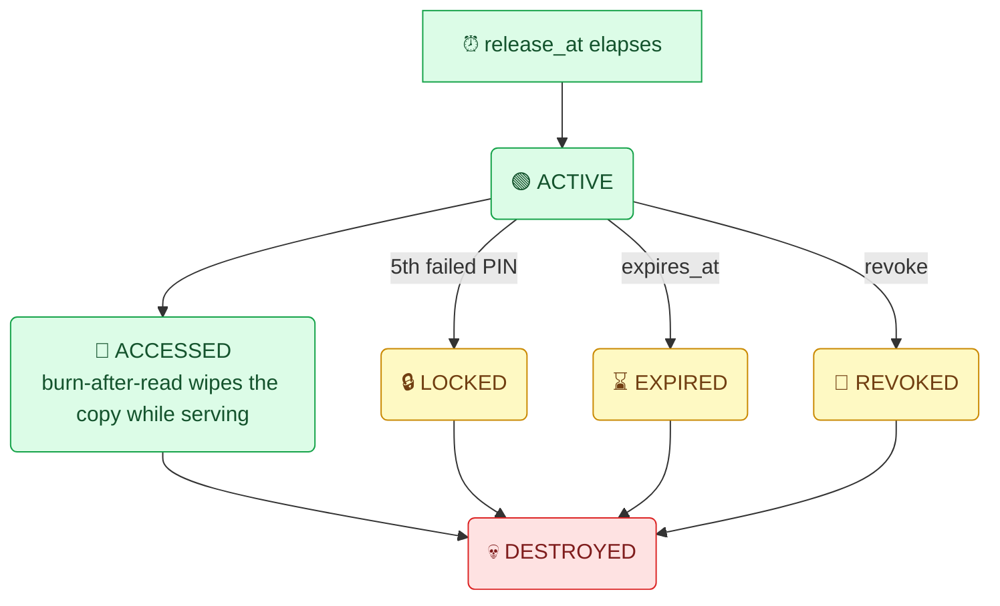

# VaultDrop — Technical Overview

> Engineering reference for VaultDrop: a policy-driven controlled-delivery system for client-side-encrypted text secrets and files. Companion documents: [`../README.md`](../README.md) (product + setup) and [`threat-model.md`](threat-model.md) (strict threat analysis).

## 1. System Overview

VaultDrop treats shared content — a text secret or an uploaded file — not as static data but as a **controlled delivery**: a payload plus an explicit, server-enforced lifecycle. Creators define who may open it, how access is verified, when it becomes available, how many times it can be opened, and when it must be destroyed.

All cryptography executes in the browser via the Web Crypto API. The backend (Next.js API routes over Supabase PostgreSQL + Storage) sees ciphertext, hashes, policy state, and audit events — never plaintext secrets, raw PINs (new deliveries), or decryption keys.

## 2. Design Principles

| Principle | Meaning |
|---|---|
| **Client-side encryption** | Content is encrypted before submission; decryption happens only on the recipient's device. |
| **Controlled access** | Every delivery defines its own authentication and access policy. |
| **Limited exposure** | View limits, burn-after-read, expiration, revocation, and lockout destruction minimize the lifetime of readable data. |
| **Explicit lifecycle** | A delivery is a state machine (`active → accessed/locked/expired/revoked/destroyed`), not a permanent object. |
| **Server-side enforcement** | Policies are gates evaluated at access time inside atomic database operations — never UI-only. |
| **Honest limitations** | Out-of-scope risks are documented, not hand-waved (see §24 and the threat model). |

## 3. Core Workflow


## 4. Delivery Domain Model

A **delivery** is the central aggregate:

| Field group | Contents |
|---|---|
| Payload | `kind` = `text` (per-copy ciphertext lives on recipient rows; single-recipient rows also mirror it for legacy access) *or* `file` (blob reference: `storage_path`, `file_nonce`, `enc_version`, name/MIME/size metadata) |
| Authentication | Per-recipient bcrypt PIN hash + `pin_scheme` (`raw` \| `sha256`) |
| Recipients | 1–50 rows, each with its own URL token, wrapped key material, counters, status |
| Policy | `max_views` (0 = unlimited), `burn_after_reading`, `expires_at`, `release_at`, `renewal_deadline` / `renewal_window_minutes` |
| State | Lifecycle `status`, view/failed-attempt counters, timestamps |

Identifiers (`delivery id`, `creator_token`, `url_token`) are 128-bit random values encoded as 22-char URL-safe strings — no sequential IDs, no user input.

## 5. Text Encryption Architecture

Every encrypted copy gets its own key, derived from its own PIN inside the browser (`src/lib/crypto.ts`):

```
salt   = random(128 bits)            // unique per encrypted copy
nonce  = random(96 bits)             // fresh per AES-GCM encryption
key    = PBKDF2-SHA256(pin, salt, 600_000 iterations) → 256-bit AES-GCM key
ct     = AES-256-GCM(key, nonce, plaintext, tagLength=128)
```

Transport: the client sends `{ciphertext, nonce, salt, iterations}` plus the **PIN transport value** — `SHA-256(pin)` hex for new deliveries (`pin_scheme='sha256'`), the raw digits only from legacy clients (`pin_scheme='raw'`). Decryption re-derives the key locally from the **raw** PIN; wrong PINs fail GCM authentication closed. PBKDF2 parameters arrive from the client but are validated server-side (10,000–1,000,000 iterations accepted).

Randomness uses rejection sampling for unbiased digit generation and `crypto.getRandomValues` throughout.

## 6. File Envelope Encryption

Files add one layer so large payloads are encrypted once regardless of recipient count:

1. Browser generates a random **256-bit DEK** (`generateFileKey`).
2. File encrypted once: `AES-256-GCM(DEK, fresh nonce, bytes)` → uploaded ciphertext.
3. DEK **wrapped per recipient**: identical construction to §5 (PBKDF2-SHA256 of that recipient's PIN → AES-GCM over the DEK). Each wrapped bundle `{encryptedData, nonce, salt, iterations}` is independent and stored in that recipient's existing row columns.
4. Upload path: `POST /api/delivery/file` (multipart) with ciphertext + `meta` JSON. Server validates size ≤ 25 MiB (`413`), MIME allowlist (`415`), then uploads the blob to private Storage **before** inserting DB rows — any failure rolls both sides back.
5. Access returns the ciphertext body with an `X-Vaultdrop-Meta` header (base64url JSON): `{kind, fileName, mime, size, iv, enc, wrapped:{e,n,s,it}, destroyed, burnAfterReading}`.
6. Recipient unwraps the DEK locally with their raw PIN, decrypts bytes, and downloads under the original filename.

Guarantees: the raw DEK and the plaintext file never reach the server; stored objects are always `application/octet-stream`; object paths are randomized (`deliveries/<deliveryId>/<random>.bin`, both components 128-bit random) so filenames never leak into storage layout; a file retrieval consumes a view through the same RPC as text.

## 7. Recipient-Specific Access

Each recipient owns an independent link (`/r/<url_token>`), PIN, encrypted copy, and status (`pending | opened | revoked | locked`). Compromising or revoking one recipient never affects another.

```text
Delivery
├── Recipient A → own ciphertext/wrapped key · own PIN · openable
├── Recipient B → own ciphertext/wrapped key · own PIN · opened
└── Recipient C → revoked (copy wiped)
```

The creator dashboard reads per-recipient states plus the audit timeline; per-recipient revocation wipes that row's key material and conditionally deletes the shared blob once no consumable copies remain (`deliveryHasLiveCopies` check).

## 8. Authentication

| Mechanism | Behavior |
|---|---|
| **Verification** | bcrypt comparison of the transport value against `recipients.pin_hash` (legacy route: `deliveries.pin_hash`). Server never learns raw digits for `sha256`-scheme deliveries — it stores `bcrypt(sha256(pin))`. |
| **Rate limiting** | `check_pin_rate_limit` SQL function counts `pin_failed` events per (IP, delivery) in a sliding 15-minute window (max 5); dual-mode since migration 007 (accepts url_token or delivery id). Returns `429` with `Retry-After`. A cheap in-memory limiter remains as a first gate on the legacy path. |
| **Lockout self-destruct** | The 5th failed attempt (counted atomically, §17) destroys that copy — key material nulled, status `locked`, events logged, file blob deleted if no live copies remain. |

## 9. Authorization

| Access type | Requirement |
|---|---|
| **Creator operations** (status, events, revoke, renew, delete) | `creator_token` — distinct from the delivery ID and never part of share links |
| **Recipient access** | Secret `url_token` **and** the PIN |
| **Database reads/writes** | RLS enabled on all tables; no anon policies grant data access — everything flows through service-role API routes |
| **Storage objects** | Bucket has **no policies at all**; anon/authenticated roles are denied by default — only service-role code touches objects |

## 10. Time-Locked Release

`release_at` gates every read path. Before release, both access routes return `423` with `releaseAt`; recipient metadata reports `state: "not_released"`. Creation rejects past `release_at` and `expires_at ≤ release_at`. Enforcement is server-side at request time — frontend state plays no role.

## 11. Lifecycle Controls

| Control | Mechanism |
|---|---|
| Expiration | Lazy transition at access time (wipe + `410`) **and** daily purge sweep |
| Burn-after-read | Copy's ciphertext/nonce/salt/pin_hash nulled in the consumption transaction; delivery flips to `destroyed` when the last live copy goes |
| Max views | Counted inside the locked transaction; allowance exhaustion burns the copy |
| Revocation (delivery) | All recipient copies wiped, blob deleted, status `revoked` |
| Recipient revocation | One row wiped; conditional blob cleanup |
| Dead man's switch | Deadline passed ⇒ destroy on next touch *and* via purge (§12) |
| Lockout | After 5 atomic failed attempts (§8) |
| Purge | Daily cron: expire stale actives, wipe their recipients, delete rows dead >30 days (+ blob sweep), prune events >30 days |

Blob deletion follows one rule everywhere: the encrypted file object is removed when its delivery reaches a terminal state — immediately for whole-delivery deaths (revoke/delete/deadman/expiry) and after the last consumable copy disappears for per-recipient deaths (burn/lockout).

## 12. Dead-Man's Switch

Creation optionally sets `renewal_deadline = now + renewal_window_minutes` (1–43,200). The creator pushes the deadline forward via `/renew`. If the deadline passes: any access attempt triggers `destroyForDeadManSwitch` (delivery wiped to `destroyed`, all recipient copies wiped, event logged, blob removed) even before the cron runs — a silent sender cannot leave a live delivery behind.

## 13. Delivery State Model

States: `active` · `accessed` · `locked` · `expired` · `revoked` · `destroyed`
Recipient states: `pending` · `opened` · `revoked` · `locked`



Public metadata endpoints translate this machine into user-facing states (`not_released`, `deadman`, etc.) without leaking internal fields.

## 14. Audit Events

`access_events` records: `created` · `pin_validated` · `pin_failed` · `accessed` · `expired` · `revoked` · `locked` · `destroyed` — each with timestamp, optional `recipient_id`, and JSON metadata (IP value as supplied by the proxy-sanitized `clientIp()` helper, remaining attempts, failure reasons). Events power the creator timeline and the database-backed rate limiter; they provide **auditable access history**, not cryptographic non-repudiation. Entries older than 30 days are pruned by the purge sweep.

## 15. PostgreSQL Architecture

Supabase PostgreSQL, three primary tables (migrations 001–008):

| Table | Stores | Notes |
|---|---|---|
| `deliveries` | ID, title/content type, legacy mirrored ciphertext columns, `pin_hash`/`pin_scheme`, full policy set, lifecycle `status`, counters, timestamps; file deliveries add `kind, file_name, file_mime, file_size, storage_path, file_nonce, enc_version` | Indexed on expiry/status/creator_token/release_at/renewal_deadline/storage_path |
| `recipients` | `url_token` (unique), `name`, `pin_hash`, per-copy key material, `status`, counters, `opened_at`/`revoked_at` | Indexed by delivery_id and url_token |
| `access_events` | Event type, delivery/recipient refs, `event_time`, JSON metadata | Indexed by delivery, recipient, time |

RLS is enabled on all three; no anon policies exist — everything flows through service-role routes.

## 16. Supabase Storage Architecture

Private bucket **`vaultdrop-files`** (migration 008): `public=false`, `file_size_limit=26214400` (25 MiB), `allowed_mime_types=['application/octet-stream']`, **no `storage.objects` policies**. Consequences:

| Property | Consequence |
|---|---|
| Anonymous access — public URL · direct fetch · anon-key SDK client | Fails in all three vectors (verified by dedicated probes in the file-delivery suite) |
| Object contents | Pure ciphertext; the server streams them only after the same PIN/policy/view checks as text |
| Object paths (`deliveries/<deliveryId>/<random>.bin`) | Randomly generated, never user-derived |

## 17. Atomic Database Operations

Three SQL functions carry the security-critical transitions:

> **Core invariant:** every security-critical state change happens *inside* these locked transactions — application code only invokes them.

| Function | Guarantee |
|---|---|
| `consume_recipient_secret` (005) | Single consumption of a copy: `pg_try_advisory_xact_lock(hashtext(recipient_id))` + `SELECT … FOR UPDATE` on both rows; all policy checks re-evaluated **inside** the lock; burn wipes key material in the same transaction; concurrent losers receive structured errors mapped to HTTP 409/410/423 |
| `record_failed_attempt` / `record_failed_attempt_delivery` (006) | Failed-PIN counting as a single self-referencing `UPDATE … RETURNING` — atomic under any contention; `SECURITY DEFINER`, execute revoked from public/anon/authenticated, granted to `service_role` only |
| `check_pin_rate_limit` (005, dual-mode 007) | Sliding-window throttle computed from `access_events` in SQL — survives restarts, holds across instances |

Both access routes fall back to optimistic CAS (`UPDATE … WHERE view_count = <snapshot>` / `failed_attempts = prev`) if the RPCs were ever missing, preserving correctness though with different contention behavior.

## 18. Race-Condition Handling

| Race | Defense | Verified by |
|---|---|---|
| **Two valid opens of a one-time secret** | Advisory lock serializes; second consumer sees nulled ciphertext → `already_consumed` (410) | Hardening suite: 20-way simultaneous open → exactly one 200 |
| **Parallel wrong PINs losing increments** | Single-statement atomic increments | Hardening suite: 12 parallel wrong PINs → counter 13, lockout fires |
| **Revocation vs. in-flight access** | Status re-checked inside the consumption lock (`delivery_invalid`, `locked`) | Hardening suite: revoked-recipient denial with correct PIN |
| **Expiry vs. in-flight access** | Expiry gate runs before any PIN work in both routes | Hardening suite: expired-delivery denial |
| **Legacy-path double-read** | Optimistic CAS on `view_count` snapshot | Legacy/hardening suites |

## 19. Application Architecture

Next.js 15 App Router + TypeScript:

```text
src/
├── app/
│   ├── page.tsx                 creator UI (text + file modes)
│   ├── r/[token]/page.tsx       recipient unlock/decrypt UI
│   ├── dashboard/[id]/page.tsx  creator dispatch board (status, renew, revoke…)
│   └── api/
│       ├── delivery/route.ts             create text (≤50 recipients)
│       ├── delivery/file/route.ts        create file (multipart)
│       ├── delivery/[id]/…               meta · access · status · events · revoke · renew · delete
│       ├── recipients/[token]/…          meta · access · revoke
│       └── purge/route.ts                authenticated cleanup sweep
└── lib/
    ├── crypto.ts        Web Crypto wrappers (text + envelope schemes)
    ├── storage.ts       bucket constants, upload/download/remove, live-copy logic
    ├── deadman.ts       trigger check + destruction helpers
    ├── bcrypt.ts        hashing/verification
    ├── ratelimit.ts     in-memory first-gate limiter + IP extraction
    └── supabase/server  service-role client factory
```

Routes validate input, enforce rate limits and policy gates, call the atomic RPCs, and shape responses; business-critical state transitions never happen in React.

## 20. Security Modules

| Module | Responsibility |
|---|---|
| Cryptographic operations | Web Crypto wrappers for text + envelope schemes (§5–§6) |
| PIN transport hashing | SHA-256 transport value with `pin_scheme` enforcement (§5, §8) |
| bcrypt verification | Server-side PIN hash comparison (§8) |
| Storage abstraction | Private-bucket-only upload/download/remove (§16) |
| Dead-man's-switch logic | Trigger check + destruction helpers (§12) |
| Rate limiting | In-memory first gate + SQL-backed sliding window (§8) |
| Atomic-consumption RPCs | Advisory-lock consumption + failed-attempt counting (§17) |

Isolating these from UI components keeps them auditable and directly exercised by the test suites.

## 21. Testing and Reliability

> ### ✅ 126 / 126 AUTOMATED SCENARIOS PASS
>
> Seven suites, executed against a live Supabase backend:

Legacy 4 · Multi-recipient 24 · Time-lock 9 · Lockout 5 · Dead-man's-switch 10 · Security hardening 31 · File delivery 43.

Coverage includes concurrency races (exactly-one-winner assertions), parallel failed-PIN counting, lockout destruction, per-recipient revocation isolation, expired/time-locked denial, byte-exact file round-trips, size/MIME enforcement, lifecycle blob deletion across burn/expiry/revoke/lockout, private-bucket anonymous-access probes, and plaintext-leak scans over every API response. Type-check passes; lint reports 0 errors (1 pre-existing config warning). Security properties are validated at the application/database boundary, not assumed from schema.

### 21.1 Measured Performance

All figures below are observed measurements against a live backend (local front end, cloud Supabase) — none estimated. API timings include validation, bcrypt work, policy gates, atomic consumption, and database round trips; file timings run end-to-end through the real browser UI, so they include client-side envelope encryption, multipart upload, storage write, PIN authentication, and streaming download.

| Operation | n | min | median | max |
|---|---|---|---|---|
| Client-side derive + encrypt (PBKDF2-SHA256 600k + AES-256-GCM) | 6 | 171 ms | 214 ms | 227 ms |
| Secret creation round-trip (`POST /api/delivery`) | 6 | 1.76 s | 1.79 s | 2.03 s |
| Metadata read (`GET /api/recipients/[token]`) | 20 | 174 ms | 197 ms | — |
| Wrong-PIN rejection → `403` | 3 | 1.32 s | 1.33 s | 1.35 s |
| Correct-PIN access → `200` + atomic burn | 4 | 1.13 s | 1.16 s | 1.19 s |
| Encrypted 1 MB upload (encrypt + POST + storage write) | 2 | 2.95 s | — | 5.17 s |
| Encrypted 1 MB download (auth + storage fetch + stream) | 2 | 4.08 s | — | 4.61 s |
| Encrypted 5 MB upload / download | 1 / 1 | 3.65 s / 3.97 s | — | — |

Load behavior:

- 30 parallel metadata reads → **30/30 succeeded**, burst wall time 1.65 s.
- **10 simultaneous correct-PIN opens of a max-views=1 copy** → exactly one `200`; the other nine received honest rejections (`409`/`410`); the winner's ciphertext decrypted correctly client-side.

Interpretation: creation/access latency is dominated by intentional security costs (bcrypt per attempt, multiple locked database transitions, cross-region DB round trips). The figures demonstrate interactive-speed performance for realistic payload sizes; they are not hosted-production SLAs.

### 21.2 Accessibility Verification

A structured audit ran **43 checks — all passed** in a real browser against both pages. Scope is deliberately documented as targeted WCAG 2.1 AA spot-checks (keyboard-only traversal, programmatic focus/ARIA inventory, computed contrast math, mobile-viewport geometry), not a full screen-reader conformance audit.

Verified results:

- **Keyboard-only operation:** every control Tab-reachable on both flows; a delivery can be composed and sent entirely without a mouse (mode radios via Enter, native file chooser via Enter on the focused input); recipient flow auto-focuses Digit 1 and unlocks fully by keyboard.
- **Visible focus indication** present on 17/18 tab stops.
- **Semantics & announcements:** `header`/`main` landmarks, single `h1`, two `radiogroup`s with `aria-checked` radios, both toggles expose `role="switch"` + `aria-checked`, all buttons named, all controls labeled; wrong-PIN failures render in a live `role="alert"` with remaining-attempt feedback.
- **Contrast (computed):** light body 16.76:1 · muted 10.89:1 · primary 5.05:1 — dark body 16.01:1 · muted 8.55:1 · primary 7.27:1 (all above AA thresholds).
- **Mobile geometry (390×844):** no horizontal overflow on either page; tap targets measured 48–62 px.

The audit found two attribute-level defects, both fixed: an unnamed toggle received an explicit accessible name, and the release-mode selector pair gained proper radio semantics. Attribute changes only — no visual or behavioral impact.

## 22. Technology Stack

| Layer | Technologies |
|---|---|
| Application | Next.js 15 (App Router), React, TypeScript, Tailwind CSS |
| Backend | Next.js Route Handlers, Supabase (PostgreSQL + Storage), Vercel |
| Crypto | Web Crypto API: AES-256-GCM, PBKDF2-SHA256 (600k), SHA-256 transport hashing; bcryptjs server-side |
| Data | PostgreSQL with RLS, advisory-lock RPCs, JSONB audit events |
| Storage | Private Supabase Storage bucket, octet-stream ciphertext objects |
| Deployment | Vercel (daily cron `0 3 * * *` for `/api/purge`) + Supabase |

## 23. Engineering Objectives

- Secure client-side handling of both string secrets and binary files
- Explicit, server-enforced access policy per delivery and per recipient
- Time- and condition-based availability (time-lock, dead man's switch)
- Deterministic destruction wired into every lifecycle exit, including storage blobs
- Race-proof security transitions at the database boundary
- Auditable delivery state transitions without exposing content
- Accessible, keyboard-operable interface — verified by targeted WCAG 2.1 AA spot-checks (§21.2)

## 24. Security Assumptions and Limitations

**Assumed trusted:** browser crypto (Web Crypto), CSP-free-but-static bundle delivery, Supabase/Vercel infrastructure boundaries, creators' and recipients' devices at rest.

**Explicitly out of scope / residual risks:**

| Out-of-scope risk | Detail |
|---|---|
| **Malicious served JavaScript** | Anyone able to modify the served bundle defeats any browser-crypto design (shared with PrivateBin et al.). Mitigated operationally (static shipping, audit logs), documented as out of scope. |
| **Compromised endpoints** | A compromised creator/recipient device sees decrypted content by definition. |
| **Recipient discretion** | Anyone who legitimately decrypts content can copy, screenshot, or save it; downloaded files cannot be remotely destroyed. |
| **Metadata visibility** | Titles, filenames/sizes/MIME types, policies, hashed IPs, and timelines are visible to the server operator. |
| **Weak-PIN offline risk** | 6-digit PINs resist online attack (throttle + lockout destruction), but an attacker holding a full database dump plus surviving ciphertext could brute-force offline; default burn-after-read and expiry exist to shrink that window. |
| **Per-instance creation limiting** | The 10/hour creation cap is in-memory (per instance); PIN-attempt throttling is database-backed and not affected. |
